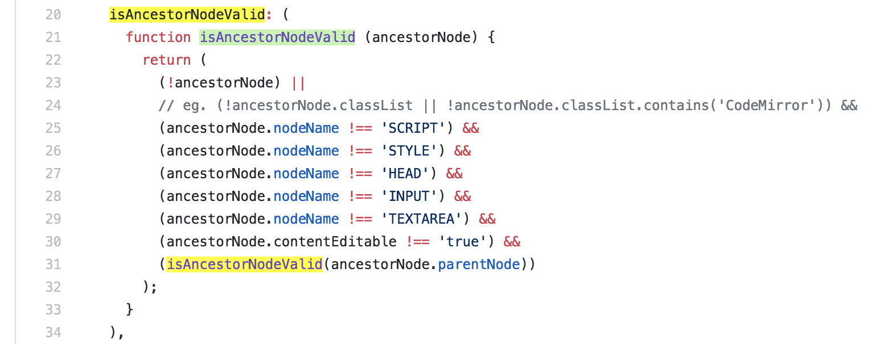

Summary
--

Highlight all occurrences of selected text, with or without a keypress.

For code inspection and document analysis: search for and find keywords.

- No need to press CMD+F
- Maintains current selection
- Open source and configurable options (JavaScript)
- Ensure a "gate" key is pressed
- Match whole word and/or case-insensitive
- Blacklist bad hosts and ancestor HTML nodes

Highlight works on all sites, including GitHub, StackOverflow, HackerNews, etc.

Installation
--

Chrome Webstore (packed, .crx):

1. Visit the [Chrome Webstore page](https://chrome.google.com/webstore/detail/selection-highlighter/nepmkgohgoagfgcoegjaggacodcpdibj)
2. Click "+ Add To Chrome", click "Add Extension"

Firefox Add-ons (packed, .xpi):
1. Visit the [Firefox Addons page](https://addons.mozilla.org/en-US/firefox/addon/selection-highlighter-v2/)
2. Click "Add to Firefox", click "Add"

GitHub (latest release):
1. Click [Releases](https://github.com/neaumusic/selection-highlighter/releases), download the latest `selection_highlighter_chrome_extension.zip` or `selection_highlighter_firefox_extension.zip` asset, unzip the folder to a permanent location
2. Add to browser
    - Chrome: go to `chrome://extensions`, click "Load Unpacked", select the `chrome_extension` folder
    - Firefox: go to `about:debugging#/runtime/this-firefox`, click "Load Temporary Add-on", select `firefox_extension/manifest.json`

GitHub (build source):
1. Click green button "Clone Or Download", "[Download Zip](https://github.com/neaumusic/selection-highlighter/archive/master.zip)", and unzip the folder to a permanent location
2. Run `yarn` in the root (see package.json scripts)
    - On mac/linux use `brew install yarn` (or better yet use [volta](https://volta.sh/) which automatically switches node/yarn versions by changing directories) if you don't have it ([homebrew](https://brew.sh/) computer club is where Apple was founded). brew and `n` / `nvm` version managers aren't really compatible with volta but I recommend volta (11/2021)

3. Install in browser
    - Chrome: go to `chrome://extensions`, click "Load Unpacked", select the `dist/chrome_extension` folder
    - Firefox: go to `about:debugging#/runtime/this-firefox`, click "Load Temporary Add-on", select `dist/firefox_extension/manifest.json`
