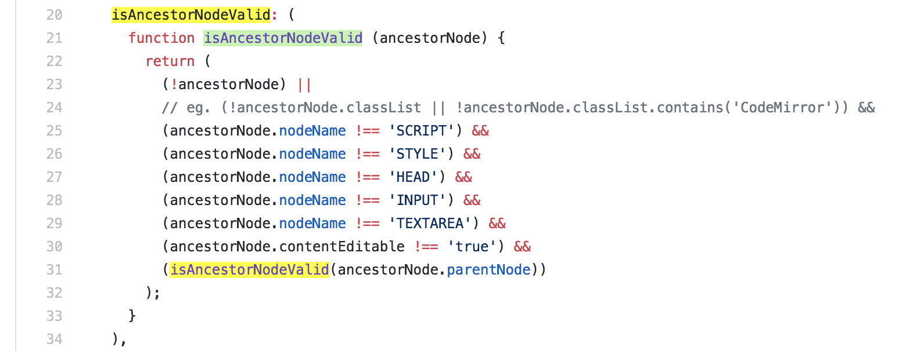

Summary
--

Highlight all occurrences of selected text, with or without a keypress.

For code inspection and document analysis: search for and find keywords.

- No need to press CMD+F
- Maintains current selection
- Open source and configurable options (JavaScript)
- Ensure a "gate" key is pressed
- Match whole word and/or case-insensitive
- Blacklist bad hosts and ancestor HTML nodes

Highlight works on all sites, including GitHub, StackOverflow, HackerNews, etc.

Installation
--

Chrome Webstore (packed, .crx):

1. Visit the [Chrome Webstore page](https://chrome.google.com/webstore/detail/selection-highlighter/nepmkgohgoagfgcoegjaggacodcpdibj)
2. Click "+ Add To Chrome", click "Add Extension"

GitHub (latest release):
1. Click [Releases](https://github.com/neaumusic/selection-highlighter/releases), download the latest 'chrome-extension.zip' asset, unzip the folder to a permanent location
2. Go to chrome://extensions, click "Load Unpacked", select the unzipped folder

GitHub (build source):
1. Click green button "Clone Or Download", "[Download Zip](https://github.com/neaumusic/selection-highlighter/archive/master.zip)", and unzip the folder to a permanent location
2. Run `yarn` in the root (see package.json scripts)

    - On mac/linux use `brew install yarn` if you don't have it ([homebrew](https://brew.sh/) computer club is where Apple was founded)

3. Go to chrome://extensions, click "Load Unpacked", select the `dist/chrome-extension` folder
